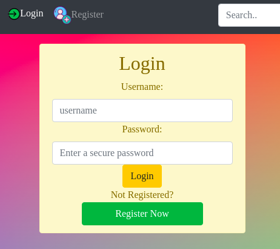
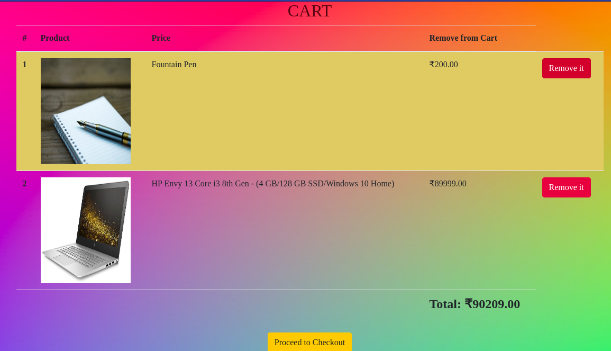
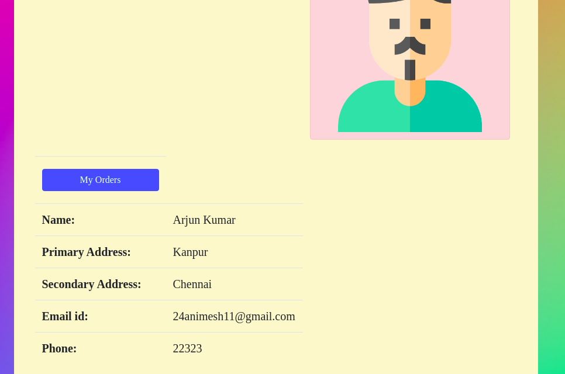

# Netcart Ecommerce Web Application
[visit netcartecommerce](http://netcartecommerce.pythonanywhere.com/ "netcartecommerce")
### Table of contents
* [General info](#general-info)
* [Functionalities](#functionalities)
* [Technologies](#technologies)
* [Visit the web app](#visit-the-web-app)
* [Contact developer](#contact-developer)

### General info
netcartecommerce is a full fledged ecommerce web application powered by django framework of python. It has most of the functionalities one would expect from an ecommerce website.
___

### Functionalities
* Consumer authentication system
    (using session authentication in django)
    

* Product Detail page
    

* Personal Cart for every registered user
    

* Checkout page and payment handling
    

* Personal Profile page for the customer
    
___

### Technologies
* Django framework based upon python3
* Django template language
* SQLite Database
* HTML
* CSS
* jquery

The application is almost entirely built using django framework from frontend to backend. It is deployed using pythonanywhere on the web. 
___

### Visit the web app
Access [the web app here](http://netcartecommerce.pythonanywhere.com/ "netcartecommerce")

___
### Contact developer
                
Animesh Kumar

email: 24animesh11@gmail.com 

phone: +91 7985851496 

<!-- Task List -->
* [x] React.js
* [x] Django
* [x] Django REST framework
* [x] Database schema design
* [x] Algorithms analysis
* [x] Multithreaded programming in C
* [x] Multiprocessing using C on linux
* [x] Image processing using OpenCV

_Spread love, Spread life_
